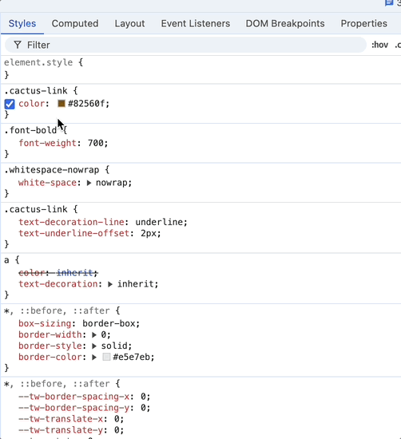

:::note[WCAG Accessibility Guidelines]
The minimum contrast ratio for normal text is 4.5:1, while large text requires a ratio of at least 3:1 to meet accessibility standards.
:::

Chrome DevTools simplifies the process of making sure your color contrast meets WCAG guidelines by allowing you to choose the nearest accessible color. Here’s how:

1. **Open DevTools**: Right-click on the web page and select `Inspect` or press `Ctrl+Shift+I`.
2. **Inspect CSS Styles**: Click on the element you want to inspect.
3. **Select Color Swatch**: Click on the color swatch in the Styles pane.
4. **Check Contrast Ratio**: Scroll down and open the `Contrast Ratio` dropdown.
5. **Adjust Color**: If the current color doesn’t pass, select the swatch next to the desired `AA` or `AAA` color contrast ratio.

